# 面向对象架构原则

## 目录

[TOC]

## 一、前言

如果一个技术已经存在3年，比如现在很火的前端技术react和vue等，那么我能预估这个技术大致还有3年的生命期，再久就不确定了；如果一个架构或设计原则已经存在15年，例如单一职责和依赖倒置原则，我可以预期它还有15年甚至更久的生命期。原则是比具体技术更抽象，更接近事物本质，也更经得起时间考验的东西。这些原则沉淀在架构师的脑海中，最终内化成他的mindset，以潜意识方式影响和指导他的架构和设计工作。

一晃我在软件研发行业工作十多个年头了，前面大部分时间做架构设计和开发，现在转型做研发管理。随着时间的推移，很多技战术细节性的东西(工具，框架，编程语言)在我脑海中渐渐模糊，但是一些平时学习积累起来，并且在实践中加深体会的软件架构设计和组织原则，这些原则性的东西却丝毫没有被时间冲淡，反而愈加清新。现在即使我不在一线开发，但这些沉淀下来的原则仍然潜移默化地影响我的日常管理和部分架构设计指导工作。我想有必要总结一下那些业界知名，给我留下深刻印象的软件架构设计和组织原则，和大家一起分享。

## 二、软件设计原则

### （一）GRASP通用职责分配软件模式

来自Craig Larman的软件设计书《UML和模式应用》[附录1]，Larman在书中提出软件设计的关键任务是职责分配，并提炼总结出9种(5种核心+4种扩展)软件职责分配模式，这些模式是比GoF设计模式更抽象的元模式。

####  1） 信息专家(Information Expert)

为对象分配职责的通用原则 – 把职责分配给拥有足够信息可以履行职责的专家

####  2） 创建者(Creator)

将创建A的职责赋给B，如果至少下面一种情况为真：

- B“包含”或者聚合A
- B记录A的实例
- B密切地使用A
- B拥有A的初始化数据

####  3）低耦合(Low Coupling)

赋予职责使得对象间的耦合度尽可能低，最小化对象间的依赖和变更影响，最大化重用。

####  4）高内聚(High Cohesion)

赋予职责使得每个对象的职责尽可能保持聚焦和单一，易于管理和理解。

####  5）控制器(Controller)

把职责赋予系统、设备或者子系统的表示类(门面控制器)，或者某个用例的表示类(用例控制器)，让控制器接收事件并协调整个系统的运作。

####  6）多态(Polymorphism)

将职责分配给多个具有同名方法的多态子类，运行时根据需要动态切换子类，让系统行为变得可插拔。

####  7）纯虚构(Pure Fabrication)

针对真实问题域中不存在，但是设计建模中有用的概念，设计虚构类并赋予职责。

####  8）间接(Indirection)

在两个或者多个对象间有交互的情况下，为避免直接耦合，提高重用性，创建中间类并赋予职责，对象的交互交由中间类协调。

####  9）受保护的变化(Protected Variation)

简单讲就是封装变化。识别系统中可能的不稳定或者变化，在不稳定组件上创建稳定的抽象接口，将可能的变化封装在接口之后，使得系统内部的不稳定或者变化不会对系统的其它部分产生不良影响。

### （二）SOLID面向对象设计原则

####  1）单一职责原则(The Single Responsibility Principle)

修改某个类的理由应该只有一个，如果超过一个，说明类承担不止一个职责，要视情况拆分。

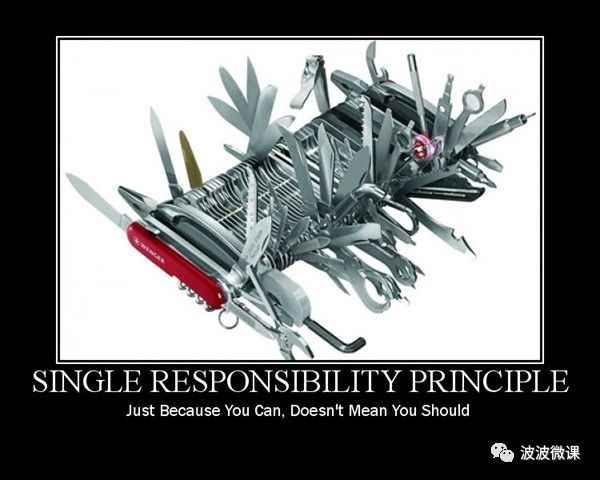

####  2）开放封闭原则(The Open Closed Principle)

软件实体应该对扩展开放，对修改封闭。一般不要直接修改类库源码（即使你有源代码），通过继承等方式扩展。

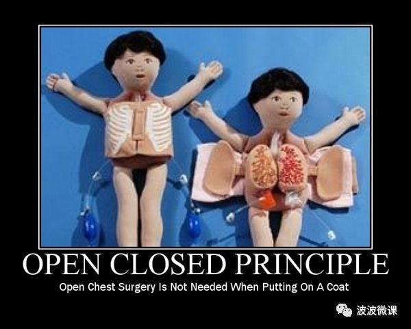

####  3）里氏替代原则(The Liskov Substitution Principle)

当一个子类的实例能够被替换成任何超类的实例时，它们之间才是真正的is-a关系。

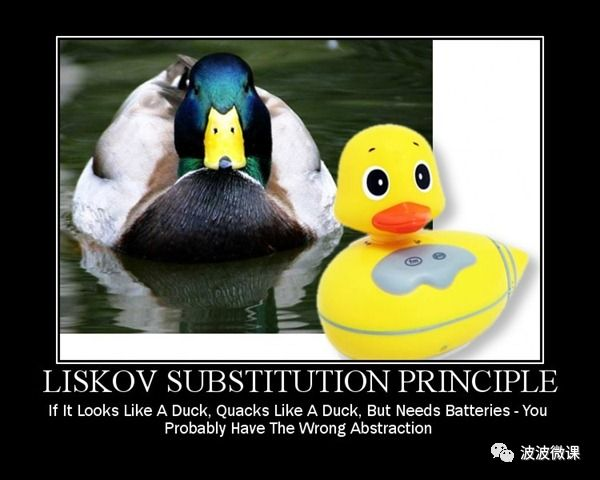

####  4）依赖倒置原则(The Dependency Inversion Principle)

高层模块不应该依赖于底层模块，二者都应该依赖于抽象。换句话说，依赖于抽象，不要依赖于具体实现。比方说，你不会把电器电源线焊死在室内电源接口处，而是用标准的插头插在标准的插座(抽象)上。

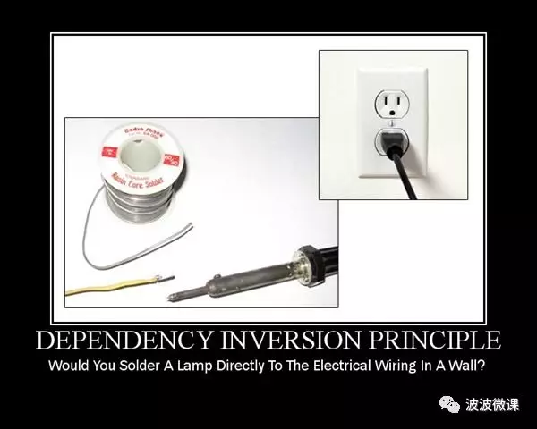

####  5）接口分离原则(The Interface Segregation Principle)

不要强迫用户去依赖它们不使用的接口。换句话说，使用多个专门的接口比使用单一的大而全接口要好。

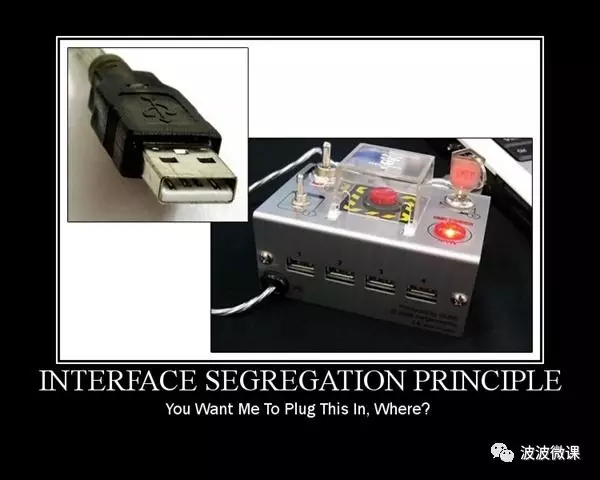

#### 6） 迪米特法则【LOW OF DEMETER】：低耦合，高内聚.

#### 7）组合/聚合复用原则【Composition/Aggregation Reuse Principle(CARP) 】：尽量使用组合和聚合少使用继承的关系来达到复用的原则.

### （三）设计模式

#### 1）设计模式分类

##### A）创建型模式
1. 抽象工厂模式(Abstract factory pattern): 提供一个接口, 用于创建相关或依赖对象的家族, 而不需要指定具体类.
2. 生成器模式(Builder pattern): 使用生成器模式封装一个产品的构造过程, 并允许按步骤构造. 将一个复杂对象的构建与它的表示分离, 使得同样的构建过程可以创建不同的表示.
3. 工厂模式(factory method pattern): 定义了一个创建对象的接口, 但由子类决定要实例化的类是哪一个. 工厂方法让类把实例化推迟到子类.
4. 原型模式(prototype pattern): 当创建给定类的实例过程很昂贵或很复杂时, 就使用原形模式.
5. 单例了模式(Singleton pattern): 确保一个类只有一个实例, 并提供全局访问点.
6. 多例模式(Multition pattern): 在一个解决方案中结合两个或多个模式, 以解决一般或重复发生的问题.

##### B）结构型模式

1. 适配器模式(Adapter pattern): 将一个类的接口, 转换成客户期望的另一个接口. 适配器让原本接口不兼容的类可以合作无间. 对象适配器使用组合, 类适配器使用多重继承.
2. 桥接模式(Bridge pattern): 使用桥接模式通过将实现和抽象放在两个不同的类层次中而使它们可以独立改变.
3. 组合模式(composite pattern): 允许你将对象组合成树形结构来表现"整体/部分"层次结构. 组合能让客户以一致的方式处理个别对象以及对象组合.
4. 装饰者模式(decorator pattern): 动态地将责任附加到对象上, 若要扩展功能, 装饰者提供了比继承更有弹性的替代方案.
5. 外观模式(facade pattern): 提供了一个统一的接口, 用来访问子系统中的一群接口. 外观定义了一个高层接口, 让子系统更容易使用.
6. 亨元模式(Flyweight Pattern): 如想让某个类的一个实例能用来提供许多"虚拟实例", 就使用蝇量模式.
7. 代理模式(Proxy pattern): 为另一个对象提供一个替身或占位符以控制对这个对象的访问.

##### C）行为型模式

1. 责任链模式(Chain of responsibility pattern): 通过责任链模式, 你可以为某个请求创建一个对象链. 每个对象依序检查此请求并对其进行处理或者将它传给链中的下一个对象.
2. 命令模式(Command pattern): 将"请求"封闭成对象, 以便使用不同的请求,队列或者日志来参数化其他对象. 命令模式也支持可撤销的操作.
3. 解释器模式(Interpreter pattern): 使用解释器模式为语言创建解释器.
4. 迭代器模式(iterator pattern): 提供一种方法顺序访问一个聚合对象中的各个元素, 而又不暴露其内部的表示.
5. 中介者模式(Mediator pattern) : 使用中介者模式来集中相关对象之间复杂的沟通和控制方式.
6. 备忘录模式(Memento pattern): 当你需要让对象返回之前的状态时(例如, 你的用户请求"撤销"), 你使用备忘录模式.
7. 观察者模式(observer pattern): 在对象之间定义一对多的依赖, 这样一来, 当一个对象改变状态, 依赖它的对象都会收到通知, 并自动更新.
8. 状态模式(State pattern): 允许对象在内部状态改变时改变它的行为, 对象看起来好象改了它的类.
9. 策略模式(strategy pattern): 定义了算法族, 分别封闭起来, 让它们之间可以互相替换, 此模式让算法的变化独立于使用算法的客户.
10. 模板方法模式(Template pattern): 在一个方法中定义一个算法的骨架, 而将一些步骤延迟到子类中. 模板方法使得子类可以在不改变算法结构的情况下, 重新定义算法中的某些步骤.
11. 访问者模式(visitor pattern): 当你想要为一个对象的组合增加新的能力, 且封装并不重要时, 就使用访问者模式.

#### 2) 设计模式类图
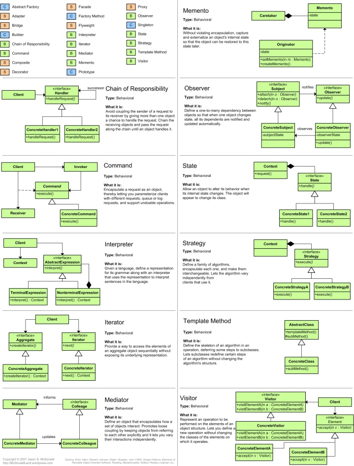
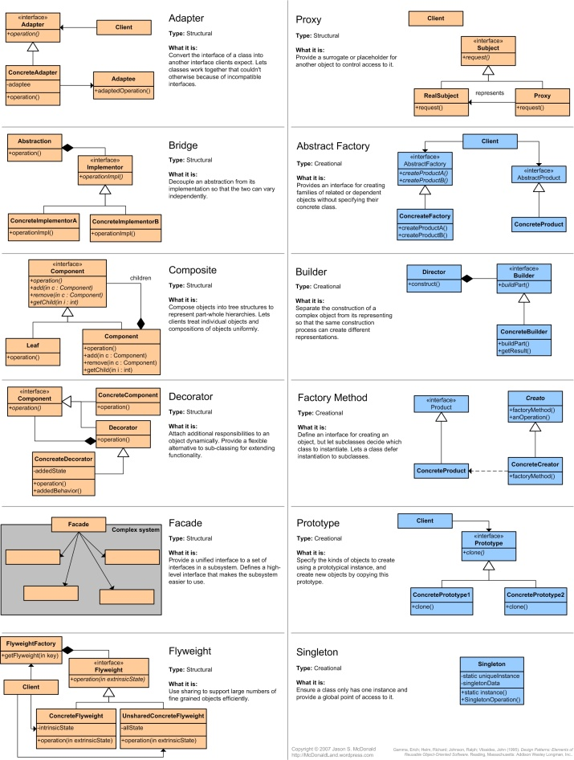

### （四）解读

1. 我职业早年主要关注软件设计和编程，所以花蛮多时间学习和消化GRASP和SOLID设计原则。这些原则对我影响很深，尤其是单一职责，信息专家，关注分离，依赖倒置/封装变化，分而治之等核心原则，现在日常研发中我时常用这些原则指导新手工程师。

2. **高内聚+低耦合**，就像道中的一阴一阳，是所有其它OO设计原则的原则(元原则)，其它设计原则都是在这两个基础上泛化衍生出来的。

3. 上述原则虽然是针对OO设计和编程提出，但是对于大规模系统架构仍然适用。比如，微服务架构就体现了：

	- 单一职责：一个微服务尽可能要职责单一，提供的接口也尽可能单一(接口分离原则)，安全/路由/限流等跨横切面的关注点(Cross-Cutting Concerns)由独立网关负责，体现关注分离(Separation of Concerns)。
	- 信息专家：当不确定哪个团队应该负责某个微服务时，一般原则也是谁拥有数据谁负责，基于有界上下文Bounded Context（一般是边界比较清晰的领域数据源）构建微服务。
	- 松散耦合：服务之间通过HTTP/JSON等轻量机制通信，服务之间不强耦合。
	- 受保护的变化和依赖倒置：服务之间只依赖抽象接口，实现可能随时变化。
	- 间接：网关在外面的客户端和内部的服务之间增加了一层间接，使两者不强耦合，可以相互独立演化。

4. 作为架构师或者设计师，有两个设计能力是需要重点培养的，也是最难和最能体现架构设计水平的：
	- **合理的职责分配能力**，也就是每个类/组件/子系统应该承担什么职责，如何保证职责单一，它们之间如何协作；
	- **系统抽象和核心领域建模能力**，需要深入一线业务域。

## 三、分布式系统架构设计原则和理论

### （一）AKF架构原则

这15个架构原则来自《架构即未来(The Art of  Scalability)》[附录2]一书，作者马丁L.阿伯特和迈克尔T.费舍尔分别是eBay和PayPal的前CTO，他们经历过eBay和PayPal大规模分布式电商平台的架构演进，在一线实战经验的基础上总结并提炼出15条架构原则：

#### 1）N + 1设计

永远不要少于两个，通常为三个。比方说无状态的Web/API一般部署至少>=2个。

#### 2）回滚设计

确保系统可以回滚到以前发布过的任何版本。可以通过发布系统保留历史版本，或者代码中引入动态开关切换机制(Feature Switch)。

#### 3）禁用设计

能够关闭任何发布的功能。新功能隐藏在动态开关机制(Feature Switch)后面，可以按需一键打开，如发现问题随时关闭禁用。

#### 4）监控设计

在设计阶段就必须考虑监控，而不是在实施完毕之后补充。例如在需求阶段就要考虑关键指标监控项，这就是度量驱动开发(Metrics Driven Development)的理念。

#### 5）设计多活数据中心

不要被一个数据中心的解决方案把自己限制住。当然也要考虑成本和公司规模发展阶段。

#### 6）使用成熟的技术

只用确实好用的技术。商业组织毕竟不是研究机构，技术要落地实用，成熟的技术一般坑都被踩平了，新技术在完全成熟前一般需要踩坑躺坑。

#### 7）异步设计

能异步尽量用异步，只有当绝对必要或者无法异步时，才使用同步调用。

#### 8）无状态系统

尽可能无状态，只有当业务确实需要，才使用状态。无状态系统易于扩展，有状态系统不易扩展且状态复杂时更易出错。

#### 9）水平扩展而非垂直升级

永远不要依赖更大、更快的系统。一般公司成长到一定阶段普遍经历过买更大、更快系统的阶段，即使淘宝当年也买小型机扛流量，后来扛不住才体会这样做不scalable，所以才有后来的去IOE行动。

#### 10）设计时至少要有两步前瞻性

在扩展性问题发生前考虑好下一步的行动计划。架构师的价值就体现在这里，架构设计对于流量的增长要有提前量。

#### 11）非核心则购买

如果不是你最擅长，也提供不了差异化的竞争优势则直接购买。避免Not Invented Here症状，避免凡事都要重造轮子，毕竟达成业务目标才是重点。

#### 12）使用商品化硬件

在大多数情况下，便宜的就是最好的。这点和第9点是一致的，通过商品化硬件水平扩展，而不是买更大、更快的系统。

#### 13）小构建、小发布和快试错

全部研发要小构建，不断迭代，让系统不断成长。这个和微服务理念一致。

#### 14）隔离故障

实现故障隔离设计，通过断路保护避免故障传播和交叉影响。通过舱壁泳道等机制隔离失败单元(Failure Unit)，一个单元的失败不至影响其它单元的正常工作。

#### 15）自动化

设计和构建自动化的过程。如果机器可以做，就不要依赖于人。自动化是DevOps的基础。

#### 16）解读

1. 这15条架构原则基本上是eBay在发展，经历过流量数量级增长冲击过程中，通过不断踩坑踩出来的，是干货中的干货。消化吸收这15条原则，基本可保系统架构不会有原则性问题。
2. 这15条原则同样适用于现在的微服务架构。eBay发展较早，它内部其实很早(差不多2010年前)就已形成完善的微服务生态，只是没有提出微服务这个概念。
3. 这15条原则可根据TTM(Time To Market)，可用性/可扩展性/质量，成本/效率分布在三个环内，如下图所示:

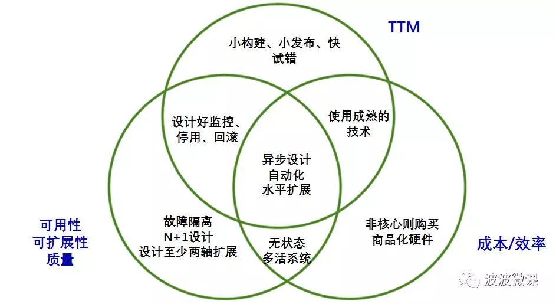

### （二）十二要素应用

Heroku[附录3]是国外知名的云应用平台。基于上百万应用的托管和运营经验，创始人Adam Wiggins提出了12要素应用宣言[附录4]。简单讲，满足这12个要素的应用是比较容易云化并居住在Heroku平台上的。

#### 1）基准代码

一份基准代码，多份部署。如果用镜像部署方式，则一个镜像可以部署到多个环境(测试，预发，生产)，而不是给每个环境制作一个不同镜像。

#### 2）依赖

显式声明依赖。如果用镜像部署，则一般依赖被直接打在镜像中，或者声明在docker file中。

#### 3）配置

在环境中存储配置。在Heroku或者类似的PaaS平台上，配置一般是推荐注入到环境变量中的。现在采用集中式配置中心也是一种流行方式。

#### 4）后端服务

把后端服务(例如缓存，数据库，MQ等)当作附加资源，相关配置和连接字符串通过环境变量注入，或者采用配置中心。

#### 5）构建、发布和运行

严格分离构建和运行。如果使用镜像部署，则构建、发布/运行是通过镜像这种中间格式严格分离的。

#### 6）进程

一个或者多个无状态的进程运行应用。容器运行时相当于进程，适用于无状态Web/API。

#### 7）端口绑定

通过端口绑定提供服务。容器也是通过端口绑定对外提供服务。

#### 8）并发

通过进程模型进行扩展。容器运行时相当于进程，通过起多个容器可以任意扩展并发数量。

#### 9）易处理

快速启动和优雅终止可最大化健壮性。docker容器支持秒级启动和关闭。

#### 10）开发环境和线上环境等价

尽可能保持开发、测试、预发和线上环境相同。容器可以保证容器内运行时环境的一致性，还需要保证不同环境的一致性，例如不同环境内的操作系统，负载均衡，服务发现，后台服务，监控告警等要尽可能一致。

#### 11）日志

把日志当作数据流。Heroku不支持本地文件，所以必须以流方式把日志输送到后台日志服务。除了日志以外还要补充考虑metrics流的采集和输送。

#### 12）管理进程

后台管理任务当作一次性的进程。其实相当于在Heroku上以独立进程方式运行任务Job。

#### 13）解读

1. 12要素应用也是当前云原生应用(Cloud Native App)的参考标准，我把这12要素也称为云应用迁移原则。满足这12个要素的应用，可以比较顺利迁移到各种云平台(Kubernetes, Marathon, Cloud Foundry等)上。
2. 对于面临企业遗留应用改造和云化迁移的架构师，可以重点参考这12条迁移原则。
3. Docker容器技术可以认为是为云迁移量身定制的技术。容器化是后续云迁移的捷径，所以遗留应用改造可以先想办法做到容器化。

### （三）CAP定理

2000年7月，加州大学伯克利分校的Eric Brewer教授在ACM PODC会议上提出CAP猜想。2年后，麻省理工学院的Seth Gilbert和Nancy Lynch从理论上证明了CAP。之后，CAP理论正式成为分布式计算领域的公认定理。

CAP认为：一个分布式系统最多同时满足一致性(Consistency)，可用性(Availability)和分区容忍性(Partition Tolerance)这三项中的两项。

#### 1）一致性(Consistency)

一致性指“all nodes see the same data at the same time”，即更新操作成功，所有节点在同一时间的数据完全一致。

#### 2）可用性(Availability)

可用性指“Reads and writes always succeed”，即服务一直可用，而且响应时间正常。

#### 3）分区容忍性(Partition tolerance)

分区容忍性指“the system continue to operate despite arbitrary message loss or failure of part of the system.”，即分布式系统在遇到某节点或网络分区故障时，仍然能够对外提供满足一致性和可用性的服务。
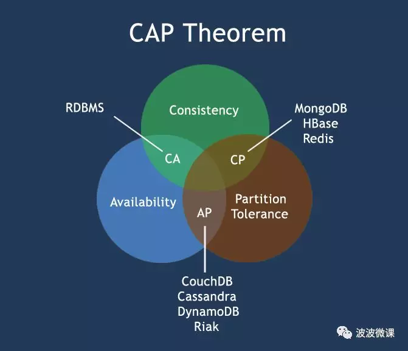

### （四）BASE理论

eBay架构师Dan  Pritchett基于对大规模分布式系统的实践总结，在ACM上发表文章提出了BASE理论，BASE理论是对于CAP理论的延伸，核心思想是即使无法做到强一致性(Strong Consistency，CAP中的一致性指强一致性)，但是可以采用适当的方式达到最终一致性(Eventual Consistency)。

BASE指基本可用(Basically Available)、软状态(Soft State)和最终一致性(Eventual Consistency)。

#### 1）基本可用(Basically Available)

基本可用是指分布式系统在出现故障时，允许损失部分可用性，即保证核心可用。比如服务降级。

#### 2）软状态(Soft State)

软状态是指允许系统存在中间状态，而该中间状态不会影响系统的整体可用性。分布式存储中一般一份数据至少存三个副本，允许不同节点间副本同步的延迟就是软状态的体现。

#### 3）最终一致性(Eventual Consistency)

最终一致性是指系统中的所有数据副本经过一段时间后，最终能够达成一致状态。弱一致性和强一致性相反，最终一致性是弱一致性的一种特殊情况。

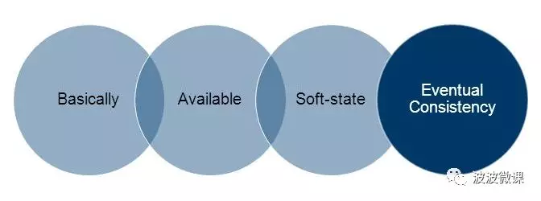

#### 4）解读

1. CAP和BASE理论可以抠得很深，背后甚至有很复杂的数学证明。我理解得相对简单浅显：性能、高可用、不丢数据和数据一致性对分布式系统来说一般是强需求，随着流量的增长，复制和分区在所难免：

	- 复制(replication)：数据在多个节点上存多份保证不丢和高可用；
	- 分区(partition)：数据按某个纬度切分分布在不同节点上分摊流量压力保证高性能，同时也是为了降低每个节点的复杂性。例如数据库的分库分表，系统拆分微服务化也是一种分区。
     这两者都会带来一致性问题，一致性在时间上有一点妥协的余地-即是最终一致性；时间上要求强一致的话，只有可用性可以适当折中。系统架构的游戏很大部分是和状态一致性作斗争的游戏。

2. 选择使用分布式产品时，比如NoSQL数据库，你需要了解它在CAP环中所在的位置，确保它满足你的场景需要。

## 四、组织和系统改进原则

### （一）康威法则

Melvin Conway在1967年提出所谓康威法则[附录5]，指出组织架构和系统架构之间有一种隐含的映射关系：

> Organization which design system […] are constrained to produce designs which are copies of the communication structures of these organization. 设计系统的组织其产生的设计等价于组织间的沟通结构。

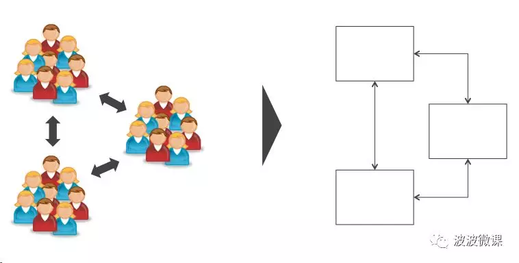

康威法则也可以倒过来阐述：

> Conway’s law reversed：You won’t be able to successfully establish an efficient organization structure that is not supported by your system design(architecture)。  如果系统架构不支持，你无法建立一个高效的组织；同样，如果你的组织架构不支持，你也无法建立一个高效的系统架构。

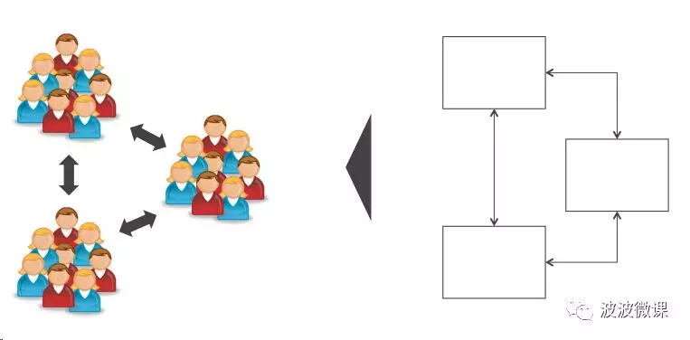

### （二）系统改进三原则

IT运维管理畅销书《凤凰项目》[附录8]的作者Gene Kim在调研了众多高效能IT组织后总结出支撑DevOps运作的三个原理(The Three Ways: The Principles Underpinning DevOps)[附录9]，我认为也是系统改进提升的一般性原理[附录7]，见下图：

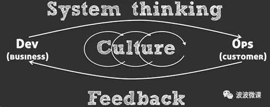

#### 1）原理一：系统思考(System Thinking)

开发驱动的组织，其能力不是制作软件，而是持续的交付客户价值。价值从业务需求开始，经过研发测试，到部署运维，依次流动，并最终以服务形式交付到客户手中。整个价值链流速并不依赖单个部分(团队或个人)的杰出工作，而是受整个价值链最薄弱环节(瓶颈)的限制。所以局部优化通常无效，反而招致全局受损。

Gene Kim特别指出：

> Any improvements made anywhere besides the bottleneck are an illusion. 在瓶颈之外的任何优化提升都只是幻象。

#### 2）原理二：强化反馈环(Amplify Feedback Loops)

过程改进常常通过加强反馈环来达成。原理二强调企业和客户之间、组织团队间、流程上和系统内的反馈环。没有测量就没有提升，反馈要以测量数据为准，通过反馈数据优化改进系统。

#### 3）原理三：持续试验和学习的文化(Culture of Continual Experimentation And Learning)

在企业管理文化层面强调勇于试错和持续试验、学习和改进的文化。

#### 4）解读

1. 康威法则给我们的启示：系统架构和组织架构之间有隐含的映射关系，你不能单方面改变一方的结构，调整时必须两边联动。系统架构如果是耦合的，就很难组织分散式的团队结构，两边映射不起来，团队之间容易摩擦导致生产率下降。所以一般先按业务边界对单块应用进行解耦拆分，同时做相应的团队拆分，使两边可以映射，每个团队可以独立开发、测试和部署各自的微服务，进而提升生产率。这就是近年流行的微服务架构背后的组织原则。详见我之前发表的文章《企业的组织架构是如何影响技术架构的》[附录6]。

2. 系统思考要求我们加强团队合作，培养流式思维和瓶颈约束思维，找出瓶颈并针对性地优化。在研发型组织中，常见的系统瓶颈如运维机器资源提供(Provisioning)缓慢，发布流程繁琐容易出错，开发/测试／UAT环境缺失或不完善，遗留系统耦合历史负担重，基础研发平台薄弱等等。这些瓶颈点特别需要关注优化。

3. 反馈原理要求我们关注基于数据的反馈，技术上的手段包括大数据分析和系统各个层次的测量监控。没有测量就没有反馈，没有反馈就没有提升。

4. 在管理文化层面：

	- 管理层要承认企业内部近50%的创新或流程改进项目是有可能失败的，即使失败，员工不会受到责罚，鼓励持续的试验和从中学习；

	- 管理层要有技术偿债意识，勿追求100%员工利用率，要预留20%~30%的时间给员工做创新和系统改进提升项目。

## 五、写在最后

上述原则是架构师必须深入理解和掌握的，但是不能盲从，实际工作中要根据业务、时间、资源和团队情况随机应变。原则有时甚至可以被违反，当然这样做一定有成本，架构师要意识这一点，并适时变通补偿。

上述原则仅是我个人视角总结，有些理解难免偏颇。如果你认为我忽略了哪些重要的原则，或理解有误，请记得发邮件和我交流！

## 六、参考

1. [UML和模式应用(原书第3版)](https://www.amazon.cn/UML%E5%92%8C%E6%A8%A1%E5%BC%8F%E5%BA%94%E7%94%A8-%E6%8B%89%E6%9B%BC/dp/B00116WMSU)

2. [架构即未来：现代企业可扩展的Web架构、流程和组织(原书第2版)](https://www.amazon.cn/%E5%9B%BE%E4%B9%A6/dp/B01DXW29IM)

3. [Heroku云应用平台](https://www.heroku.com/)

4. [The Twelve-Factor App](https://12factor.net/zh_cn/)

5. [康威法则](https://en.wikipedia.org/wiki/Conway%27s_law)

6. [企业的组织架构是如何影响技术架构的](http://www.infoq.com/cn/articles/organization-arch-influence-technology-arch)

7. [痛定思痛，谈成长型公司应该如何突破方轮子困局！](http://www.sohu.com/a/123304174_467759)

8. [凤凰项目：一个IT运维的传奇故事](https://www.amazon.cn/%E5%9B%BE%E4%B9%A6/dp/B016VW1I6U)

9. [The Three Ways: The Principles Underpinning DevOps](https://itrevolution.com/the-three-ways-principles-underpinning-devops/)

## 关于

- 整理: 唐力伟
- 来源:  系统架构之道~架构师必须知道的架构设计原理-波波微课             
- 时间: 
  - 20200418: 创建并增加设计模式的章节