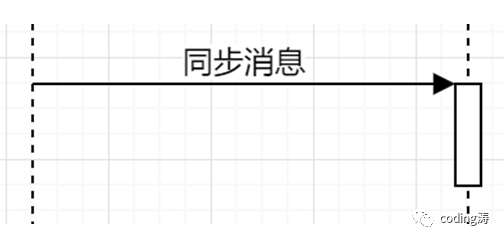

# UML概述

## 目录

[TOC]

UML，全称是Unified Modeling Language统一建模语言。UML通过文字、图形、符号来描述事物、事物的活动以及事物间关系的语言。在软件开发中，常用来协助完成需求分析、软件设计。

UML 2.0规范定义的UML组成结构，如下图所示：

1. 上图中的各个节点，同时列出了中文和英文，因为UML是由美国人提出的，当中的一些名词如果只看中文翻译可能容易误解，比如，Thing事务，这里的“事务”与软件开发中的“事务”不是一个含义，应该翻译成“元素”更贴切，但中文资料中都用“事务”这个词，为避免冲突，这里仍然使用“事务”一词。

2. UML的各种图（结构图/行为图）是由Things事务和Relationships关系组成的。

3. UML中定义了14中图，分类如上图所示，图中带红色小旗的为常用图。

4. 几个比较好的免费UML画图工具：

	- **draw.io** 大名鼎鼎JGraph出品，免费开源的画图工具，本文中涉及的样例图使用的都是draw.io画图工具
	- **ProcessOn** 在线作图网站，免费用户有保存文件数量的限制
	- **visio** 这个大家比较熟悉了，微软的产品，visio有个方便的地方时，我们可以直接将visio图复制粘贴到word中。

## **一、UML中的Structural things结构事物（UML静态元素）**

包括7种类型：

### （一）类 Class

类是对一组具有相同属性、方法的对象的抽象。类的表示法如下图中的“模板”

说明：

1. 属性或方法前可以加上一个可见性修饰符，+ 表示public；-表示private；#表示protected；~ 表示package/default；

2. 若为抽象类，在类名前加«Abstract» 且类名使用斜体。

3. 示例1为详细设计的类图，图中可以描述类的字段名、字段类型、字段默认值、字段可见性、字段注释、方法名、方法参数名及参数类型、方法返回值类型、方法注释

4. 示例2为简单设计的类图，很多情况下，比如项目初期，我们只需要简单地描述类中的字段或方法，不需要描述可见性、类型这些详细信息，此时我们可以省略这些内容。

### （二）接口 Interface

接口用于向外界声明了类或组件提供的服务。接口中，定义了一组操作的规范，它有3种表示法：

1. 矩形表示法，含关键字 «interface» 

2. “棒棒糖”表示法。 

下面的示例中展示了这两种表示法的使用。

3. “球形-凹面”表示法。这种表示法用于描述组件Component的接口，其中“球形”表示组件对外提供或组件实现了的接口，“凹面”表示组件需要的接口。

下图的例子中，订单Order组件实现了或提供了OrderEntry接口和AccountPayable接口，它需要一个实现了Person接口的对象。

### （三）协作 Collaboration

指的是有意义的交互，一组对象为了完成某个任务，相互间进行的交互；“协作”是“用例”的实现。

### （四）用例 Use Case

用例用于描述为完成某个任务而执行的一系列动作，这些动作会产生一个可观察到的结果。表示法如下图所示：

### （五）活动类 Active Class

一种可执行的类，一般是线程类或进程类。使用类图表示，但**外边框加粗**。

 ### （六）组件Component

一个相对独立的、比“类”更大的软件部件。表示法如下：

### （七）节点Node

一种可以运行的资源或物理部件，通常具有存储空间（记忆能力）或处理能力。例如，服务器、打印机、路由器等。

## 二、UML中的Structural things结构事物（UML动态元素）

包括2中类型：

### （一）交互 Interaction

对象间交换消息的动作，用一条带箭头的直线表示。

### （二）状态机 State Machine

用于描述对象在生命周期内，在事件驱动下，所经历的状态序列。一个状态机由多个状态组成。

## 三、UML中的关系Relationships

UML关系中，按关系的由弱到强如下图所示：

### （一）依赖关系（Dependency）

依赖指的是两个对象之间，一个对象发生变化会引起另一个的对象的变化。用带有箭头的虚线表示。

---

图中的“**依赖关键字**”根据依赖关系类型定。UML定义了4种依赖关系：**使用依赖、抽象依赖、授权依赖、绑定依赖**。详细说明如下：

1. 使用依赖。表示A使用了B提供的服务。使用“use”关键字。它可以细分为下面4种类型的使用依赖；

| 使用依赖   | 描述                 | 关键字      |
| ---------- | -------------------- | ----------- |
| 调用依赖   | A调用了B的方法       | call        |
| 参数依赖   | A方法使用了B作为参数 | parameter   |
| 发送依赖   | A接收B发送的信号     | send        |
| 实例化依赖 | A的方法创建了B的实例 | instantiate |

2. 抽象依赖。指的是从不同抽象级别或不同视角表示相同概念的模型之间的相互关系，它包括3种类型：

| 抽象依赖 | 描述                                                         | 关键字 |
| -------- | ------------------------------------------------------------ | ------ |
| 跟踪依赖 | 声明表示相同概念的不同模型之间存在一些比较模糊的联系         | trace  |
| 精化依赖 | 声明表示相同概念的不同模型之间存在映射关系                   | refine |
| 派生依赖 | 声明某个实例可以从其他实例推导得出。例如Person类的生日和年龄属性，年龄可以推导得出年龄。 | derive |

3. 授权依赖。表示一个元素限制了另一个元素的访问权限，它包括3种类型：访问依赖（access）、导入依赖（import）、友元依赖（friend）

| 授权依赖 | 描述                                                       | 关键字 |
| -------- | ---------------------------------------------------------- | ------ |
| 访问依赖 | 允许一个包访问另一个包                                     | access |
| 导入依赖 | 允许一个包访问另一个包的内容并为被访问包的组成部分添加别名 | refine |
| 友元依赖 | 允许一个元素访问另一个元素，不管访问元素是否限制了可见性   | derive |

4. 绑定依赖。表示模板元素与模板实例之间的依赖关系。关键字“bind”。例如，java中List<T>这个泛型类与List<String>实例类。

### （二）关联关系（Association）

1. 关联关系是一种结构性的关系，它的表示法可以包括以下3个元素：

1.1. 关联名（Name），用来描述关联关系的性质

1.2. 角色（Role），用于标注关系中两方在关联关系中所承担的角色。

1.3. 多重性（Multiplicity），用于描述有多少对象参与关联关系。可以有1对1、1对多、多对1、多对多、一对n等多种类型。使用“*”表示大于等于0个，使用“1..*”表示大于等于1个，“n, m”表示n或m；“n..m”表示n到m

2. 关联关系的类型，包括单向关联、双向关联、自关联以及两个特殊的关联关系，聚合与组合。

2.1. 单向关联：实线箭头表示，如下图所示，单向关联中Class A知道Class B，但Class B不知道Class A。一般是A类引用了B类作为它的一个属性字段。

2.2. 双向关联：实线无箭头表示。

2.3. 自身关联：由自身出发，回到本身

2.4. 聚合关联：用于描述两个独立的类之间的整体与部分的关系。

2.5. 组合关联：组合是一种特殊的聚合关系，不同的是，组合关系中，各个类的创建和撤销都在同一个周期内。

### （三）泛化关系（Generalization）

指的是子类和父类之间的继承关系

### （四）实现关系（Realization）

指的是类与接口之间的实现关系

## 四、UML 2.0规范中的图

定义了14中基本的图，分为两大类：

1. 结构图（Structure Diagram）

用于描述系统的静态架构、系统要素（类、对象、接口、组件等）以及要素之间的关联和依赖关系。

2. 行为图（Behavior Diagram）

用于描述系统运行过程中的动态变化。 

UML图分类：

其中，常用图有7种图（表中标红的部分）

### （一）类图（Class Diagram）

类图用于描述各种类的结构及关系。类图中包括了类、接口、包、及各种关系，这些元素的说明参考前面的介绍。类图示例如下：

对于已存在的项目，可以通过工具自动生成类图。例如，eclipse的类图生成插件AmaterasUML。

### （二）组件图（Component Diagram）

用于描述软件系统中，遵从并实现了一组接口的可替换的软件模块，它展示了系统中各个组件间的结构关系。

组件图的元素包括：构件(Component)、接口(Interface) 、关系(Relationship) 、端口(Port) 、连接器(Connector)。

说明：

1. 组件的接口分两种：“球”形接口表示该组件提供或实现的接口，此时组件为接口提供方；“凹面”形接口表示该组件需要或依赖的接口，此时组件为接口调用方；两种接口都是用实线与组件连接。

2. “球”形与“凹面”形组合在一起，例如“支付订单接口”，此时可以很直观地体现接口的提供方和调用方。

###  （三）部署图（Deployment Diagram）

部署图主要描述了系统运行中的硬件节点、软件系统、连接方式、网络环境等之间的关系。

###  （四）用例图（Use Case Diagram）

用例（use case）用于描述系统具备什么样的功能。它是**从用户的角度对系统行为的进行描述，不关心系统的实现细节**。

- 包含的元素有四种：

    1. 参与者（Actor）：也成为角色/用户

    2. 系统边界（System Scope）

    3. 用例（Use Case）：注意，用例的命名使用“动宾”结构命名

    4. 关联（Association）：用于表示参与者或用例间的关系

- 用例图的关系分为两个层次：

    1. 参与者与参与者之间的关系：如上图中，普通用户和VIP用户都是用户的子类，体现的是泛化关系（继承）

    2. 用例与用例之间的关系，包括以下3种：
        2.1. 包含关系（include）：是指一个用例的行为包含了另一个用例的行为，例如：

        

        2.2. 扩展关系（extend）：是指一个用例对另外一个用例的功能扩展。注意在绘图时，带箭头的线要**从扩展用例指向被扩展的用例**。扩展用例的执行条件：被扩展的用例会存在一个或多个扩展点（extensionpoint），**只有当扩展点激活（即满足一定条件）时，扩展用例才会执行。**下图的图书管理系统中，当读者遗失图书时，“交罚款”用例开始执行。 

        

        2.3. 泛化关系。将多个用例的相同结构和行为抽象成父用例，子用例继承父用例。例如：

        

- 用例图示例

	

### （五）状态图（State Machine Diagram）

状态机图，简称为状态图，用于描述对象所有可能的状态以及由事件引起的状态变化过程。

- 状态图主要包括两种元素：状态和转换。

    - 状态：使用圆角矩形表示状态，分为简单状态（Simple State）和组合状态（Composite State），其中组合状态指的是内嵌了子状态图的状态。多个子状态之间存在**顺序和并发**两种关系。如下图所示，1、2为顺序子状态（Sequence State），1、3为并发子状态（ConcurrentState）。

        

        - 历史状态（History States）：它是一个伪状态（Pseudo State）,其目的是记住从组合状态中退出时所处的子状态，当再次进入组合状态，可直接进入这个子状态，而不是从组合状态的初态开始。历史状态分两种：

            1. 浅（Shallow）历史状态：只记住最外层组合状态的历史，使用H表示；

            2. 深（Deep）历史状态：记住任意深度的组合状态的历史（组合状态的子状态也是可以嵌套子状态，故存在深度的概念），使用H表示

            

    - 转换（Transition）：指的是对象在执行某个事件时，状态发生变化。

        转换的表示格式：“触发事件Trigger（参数）[条件Guard]/动作Effect”。

        

- 状态图示例:

	下图是关于网上购物订单的状态图 

	

### （六）活动图（Activity Diagram）

活动图描述的是系统的活动变化流程。活动图可看作是状态图的特殊形式。特殊性在于**活动图中的一个活动结束后将立即进入下一个活动，不需要事件的触发**。

一**个活动内部是由多个动作组成，它是非原子性的。**通常，一个活动执行完后，都会引起系统状态发生改变或返回某个值。例如：在线购物时“下单”这个活动，内部就包括“校验商品库存是否充足”“清空购物车”“通知卖家”等一系列动作，这些动作都是原子性的。

- 活动图的组成元素及说明

    1. 活动（Activity）：表示的是某流程中的任务的执行。它一般由多个动作组成，是非原子性的。通常，一个活动执行完后，都会引起系统状态发生改变或返回某个值。使用圆角矩形表示。

    2. 动作流（Action Flow）：指的是动作状态之间的转换。一个活动执行完后自动切换到下一个活动，不需要触发动作，但可以使用条件限制转换。例如：

		

    3. 分支（Branch）与合并（Merge）:分支表示基于某种条件的多种可选的控制流，合并用于对分支的结束。

		

    4. 分叉（Fork）和汇合（Join）: 分叉表示并发运行的控制流，合并用于对分叉的结束，即并发的结束。

		

    5. 泳道（Swimlane）: 泳道是将多个活动根据某个条件（一般是执行对象）化分为若干组。

		

### （七）顺序图（Sequence Diagram）

顺序图也称为时序图，是一种描述对象之间传送消息时的时间顺序，它能显示各个对象动作的顺序。特别注意，**顺序图中，消息的传递代表的是职责的转移，不代表数据的传递，转移过程可能发生了数据传递，也可能没发生**。

顺序图包含的元素主要有：角色（Actor）、对象（Object）、生命线（Lifeline）、激活（Activation）、消息（Message）等。

1.  对象有3种表示方式：“对象名：类名”、“：类名”、“对象名”。

2. 消息种类有4种：

    2.1. 同步消息（Synchronous Message）：使用带实心三角箭头的实线表示

    

    2.2. 异步消息（Asynchronous Message）：使用带开放箭头的实线表示

    

    2.3. 返回消息（Return Message）：使用带开放箭头的虚线表示

    

    2.4. 自关联消息（Self-Message）：表示调用对象自身的方法调用，下图中的两种表示方法都可以。

    

3. 创建对象和销毁对象:

4. 约束条件。表示方式：在描述前面加上[约束条件]，表示发生职责转移需要满足的条件。例如：

## 关于

- 原文:  UML学习笔记 - coding涛
- 整理: 唐力伟
- 时间: 
  - 20200419: 创建