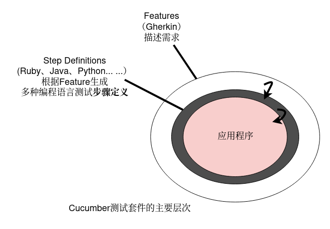
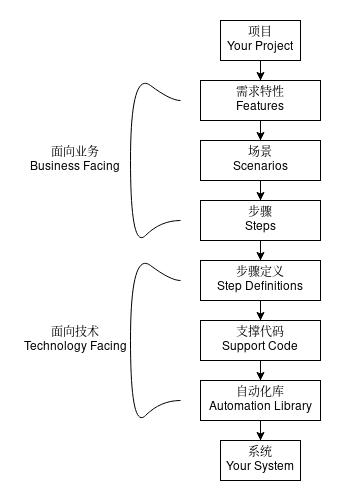

#  行为驱动-Cucumber连接需求与测试

## 目录

[TOC]

## 概述

个人感觉这个框架非常适合通过类似`UI`层面的理解，开展自动化测试，不仅能把用例中的测试步骤以非常友好的形式展现出来，而且能够非常灵活的构建场景；IDEA自带对Cucumber的支持，只需在插件中开启即可使用。`Cucumber`字面含义是黄瓜包含一组功能集合，`Gherkin`是需求描述的领域语法，存放在扩展名为*.feature的文件中。

## 一、简介

- `Cucumber` 是一个能够理解用普通语言描述的`测试用例`的行为驱动开发（`BDD`）的`自动化测试`工具，用**Ruby**编写，支持`Java`和`·Net`等多种开发语言。

- `Cucumber`可以让人们用近似自然的语言去描述`Feature`特性和场景，根据`Feature`驱动开发。用作软件技术人员和非技术之间验收测试的桥梁。它是一个命令行工具。运行后，会执行`features`中的内容。`feature`中的`step`会调用`step_definitions`可以用标签来组织场景支持40多种语言高质量集成。

- 示例:

  - 需求话术：

    - 立场：作为一名HR
    - 功能(Feature)：我期望能够方便的修改密码
    - 场景(Scenario)：我在人力资源系统中更新其它用户的密码
    - 假如(Given)：我在HR系统中具有Admin账号
    - 当(When)：我更新另一个用户的密码时
    - 然后(Then)：我收到一条更新密码成功的消息
    - 并且(And)：该用户的密码更新为新的密码
    
  - 领域语言，需求人员从用户身份视角以领域语言的形式描述需求: 

      ~~~gherkin
      Feature: Update password
       Scenario: Admin user can update the user password
         Given I am in the HR system with an Admin account
         When I update password of another user
         Then I receive a message for updating password successfully
         And user password is updated to the new password
      
      #以下是中文的描述
      Feature: 作为一名HR我希望能够方便的更新用户密码
       Scenario: 管理员用户可以更新用户密码
         Given 我在人力资源系统中有一个管理帐户
         When 我更新了另一个用户的密码
         Then 我收到一条更新密码成功的消息
         And 将用户密码更新为新密码
      ~~~

  - 测试代码，由Feature生成测试框架代码, 由开发人员实现测试用例。使用TestNG，上述场景可以实现如下: 

    ~~~java
    @test
    public void testAdminUserCanUpdateUserAccountPassword() {
      // create users 创建用户
      User userAdmin = new User(UserRole.ADMIN, username, password);
      User user = new User(UserRole.VIEWER, user_username, user_password);
           
      // use Admin user to update another user password 使用管理员用户更新其他用户的密码
      String message = userAdmin.updatePassword(user, user_new_password);
      
     
      // verify password changed  验证更新的密码
      Assert.assertEquals(message, "Password changed successfully");
      Assert.assertEquals(user.getPassword(), user_new_password);
    }
    ~~~

- 行为驱动开发`BDD`好处:

  - 积累用例: 使用无所不在的语言编写`BDD`测试，这是一种围绕领域模型构建的语言，被开发人员、测试人员、BA人员和客户组成的所有团队成员广泛使用。
  - 增进沟通: 连接软件团队的技术人员和非技术人员。
  - 代码连接: 允许与开发人员的代码直接交互，但是`BDD`测试是用一种语言编写的，业务利益相关者也可以使用这种语言编写测试。
  - 自动测试: 最后但并非最不重要的是，验收测试可以自动执行，同时也可以由业务利益相关者手动执行

## 二、Cucumber三大组成

### （一）、组成

功能特性: `Features`

步骤定义: `Step_definitions`

执行命令: `Cucumber command`

### （二）、对应传统测试工具

Feature (功能)-------------test suite （测试用例集）
Scenario（情景)-----------test case （测试用例）
Given（给定）-------------setup（创建测试所需环境）
When（当）----------------test（触发被测事件）
Then（则）-----------------assert(断言，验证结果)

### （三）、工作原理

## 三、Features 定义需求

- 语法规则:

  - 基于`Gherking`，该语言支持英文、中文等自然语言，并能够生成具体的编程语言代码
  - `Feature`文件必须以`.feature`命名
  - 包含标题`title`，多个场景`scenarios`，每个场景包含多个步骤`step`
  - 步骤的定义必须以关键字`Given`、`When`、`Then`、`And`开始。

- 语法示例:

  - 由于`Gherkin`是一种结构化语言，它遵循一些语法，让我们先来看一个简单场景

    ~~~gherkin
    Feature: Add
      Scenario Outline: : add some number
        Given I input <int1> and <int2>
        When I press add
        Then I got <int3>
        Examples:
        | int1 | int2 | int3 |
        | 1    | 1    | 2    |
        | 2    | 2    | 4    |
    ~~~

  - `Gherkin`也支持中文

    ~~~gherkin
    # language: zh-CN
    功能: 加法运算
      场景大纲: 对两个输入数字进行计算
        假如: 输入两个数字 <int1> 和 <int2>
        当: 执行加法操作
        那么: 返回 <int3>
        例子:
          | int1 | int2 | int3 |
          | 1    | 1    | 2    |
          | 2    | 2    | 4    |
    ~~~

## 四、Step_definitions 定义步骤

- 实现执行Feature中描述的业务代码

  `src/main/java/io.cucumber.skeleton.Adder.java`

  ~~~java
  package io.cucumber.skeleton;
  
  public class Adder {
      int v1,v2;
      int value;
  
      public Adder(int v1, int v2) {
          this.v1 = v1;
          this.v2 = v2;
      }
  
      public void add(){
          value = v1 + v2;
      }
  
      public int getValue() {
          return value;
      }
  }
  ~~~

  

- 根据`feature`文件中定义的`step`编写对应的测试代码，引入合适的框架这些代码结构会根据`featuer`文件中的定义为特定的编程语言生成代码结构。

  `src/test/java/io.cucumber.skeleton.StepDefinitions.java`

  ~~~java
  package io.cucumber.skeleton;
  
  import io.cucumber.java.en.Given;
  import io.cucumber.java.en.Then;
  import io.cucumber.java.en.When;
  import io.cucumber.java.zh_cn.假如;
  import io.cucumber.java.zh_cn.当;
  import io.cucumber.java.zh_cn.那么;
  import org.junit.Assert;
  
  public class StepDefinitions {
  
      Adder adder;
  
      @Given("I input {int} and {int}")
      public void i_input_and(Integer int1, Integer int2) {
          adder = new Adder(int1, int2);
      }
  
      @When("I press add")
      public void i_press_add() {
          adder.add();
      }
  
      @Then("I got {int}")
      public void i_got(Integer int1) {
          Assert.assertEquals(2, adder.getValue());
      }
  
      @假如(": 输入两个数字{int} 和 {int} )
      public void 输入两个数字_和(Integer int1, Integer int2) {
          adder = new Adder(int1, int2);
      }
      
      @当(": 执行加法操作")
      public void 执行加法操作() {
          adder.add();
      }
  
      @那么(": 返回 {int} ")
      public void 返回(Integer int1) {
          Assert.assertEquals(2, adder.getValue());
      }
  }
  ~~~

  

## 五、Cucumber command 执行测试

- 运行：`*.feature`文件。`cucumber`会分析`feature`文件中定义的`step`，然后去`Step_definitions`寻找相匹配的`step`，执行`step`中的代码。

- 运行结果能够以日志、json、html等形式保存，fail的情况查看对应log日志

  ~~~gherkin
  Scenario: add some number # io/cucumber/skeleton/add.feature:2
    Given I input 1 and 1   # io.cucumber.skeleton.StepDefinitions.i_input_and(java.lang.Integer,java.lang.Integer)
    When I press add        # io.cucumber.skeleton.StepDefinitions.i_press_add()
    Then I got 2            # io.cucumber.skeleton.StepDefinitions.i_got(java.lang.Integer)
  
  场景大纲: 对两个输入数字进行计算  # io/cucumber/skeleton/add_zh.feature:9
    假如: 输入两个数字 1 和 1 # io.cucumber.skeleton.StepDefinitions.输入两个数字_和(java.lang.Integer,java.lang.Integer)
    当: 执行加法操作        # io.cucumber.skeleton.StepDefinitions.执行加法操作()
    那么: 返回 2         # io.cucumber.skeleton.StepDefinitions.返回(java.lang.Integer)
  ~~~

  

## 六、Cucumber的开发过程

- 创建feature文件描述程序员可以实现的需求，包括feature,scenarios和step
- 创建特定语言的step_definitions代码，可以从feature中生成代码框架，手工填充测试用例代码
- cucumber --format progress。格式化输出。可修改为html，xml等格式输出。
- 添加断言：
	- 一个场景失败，Cucumber将此场景标记失败，转去执行下一场景。
	- 一个step失败，会跳过这个scenario的其余step，从而终止这个scenario。

## 七、Gherkin方法

- 关键字：
	- Feature
	- Background
	- Scenario
	- Scenario Outline
	- Scenarios(or Examples)
	- Given
	- When
	- Then
	- And(or But)
	- |(用来定义表格)
	- """(定义多行字符串)
	- `#` （注释）

## 八、官方代码及示例

- 多编程语言版: 点击查看[https://github.com/cucumber/cucumber]
- Java版: 点击查看[https://github.com/cucumber/cucumber-jvm]

## 九、常见问题

- 坑一：feature文件中，如果包含多个Scenario，此时出现错误控制台报错不准确或者就不说明错误情况； 我找到的方法就是将其他干扰的Scenario移除；

- 坑二：由于插件支持不完善以及中文编码需要在多处配置为UTF-8等原因，不推荐用eclipse操作，推荐使用IDEA。

- 坑三: 本地项目设置默认编码格式为：utf-8，但是Jenkins却是gbk的，很无奈；妥协了，默默的把本地文件一个一个的变为gbk格式的；
- 坑四：这个框架友好度挺高，这里的友好是对那些只看结果的人；对写代码的人有一定要求，可能会隔着很多层去运行；

## 关于

- 整理: 唐力伟
- 来源: https://www.jianshu.com/p/b934ce61c9dc
- 时间:
  - 20200418: 创建