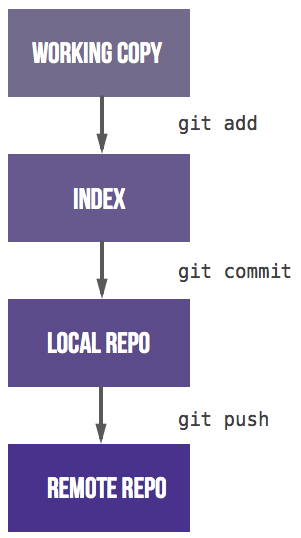
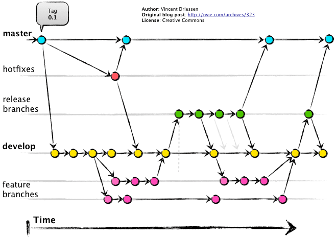
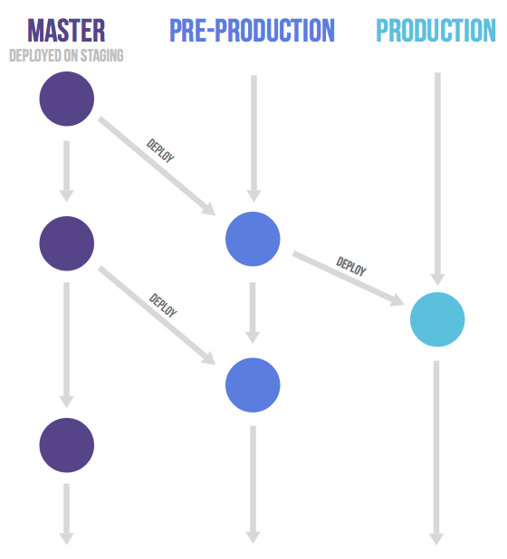

# GIT选型

## 目录

[TOC]

## 一、从SVN转向GIT

相较于SVN这样较旧的版本控制系统而言，使用git进行版本管理使得分支和合并操作变得更加容易。 它允许各种类型的分支策略和工作流。 几乎所有这些都是对git之前的版本管理系统所使用方法的改进。 但是，许多组织最终采用的工作流要么没有明确定义，要么过于复杂，要么就是未能与问题追踪系统集成。 因此，我们建议将GitLab Flow作为明确定义的一组最佳实践。 它结合了特性驱动开发（FDD）以及带问题追踪的特性分支。

那些从其他版本控制系统转向git的组织经常会发现很难开发出有效的工作流。 本文介绍了将git工作流与问题跟踪系统集成的GitLab Flow。 它提供了一种简单，透明和有效的git工作方式。

当转换为git时，您必须习惯在与同事分享某个commit之前经历三个步骤。 大多数版本控制系统只有一个步骤，就是从您的工作副本提交文件到一个共享服务器。 在git中，您需要将工作副本中的文件添加到暂存区。 之后，您将它们提交到本地仓库。 第三步是推送到共享远程存储库。 在习惯了这三个步骤后，分支模型将会成为挑战。

由于许多刚接触git的组织没有如何使用它的公共约定，它很快就会变得一团糟。 他们遇到的最大问题是有许多长期并行的分支，每一个都包含了部分变更。 人们很难确定他们应该在哪个分支上开发或部署到生产中。 应对这个问题通常是采用标准模式，例如Git-flow、Github-flow和GitLab-flow。

这三种工作流程，有一个共同点：都采用["功能驱动式开发"](https://en.wikipedia.org/wiki/Feature-driven_development)（Feature-driven development，简称FDD）。指的是，需求是开发的起点，先有需求再有功能分支（feature branch）或者补丁分支（hotfix branch）。完成开发后，该分支就合并到主分支，然后被删除。

## 二、GIT选型概述

Git 作为一个源码管理系统，不可避免涉及到多人协作。协作必须有一个规范的工作流程，让大家有效地合作，使得项目井井有条地发展下去。"工作流程"在英语里，叫做"workflow"或者"flow"，原意是水流，比喻项目像水流那样，顺畅、自然地向前流动，不会发生冲击、对撞、甚至漩涡。

如果存在银弹，市面上就不会有如此丰富的版本控制工具和流程。所有的模型都有其固有的优点或缺点。如何选择最适合的是我们最常见的问题。对于Git-flow，Github-flow和Gitlab-flow的版本控制策略提供如下的选择方针: 

- Git-flow，生产环境下具有多个版本的软件：如果代码在生产环境下具有多个版本（即典型的软件产品，如操作系统，Office软件包，自定义应用程序等），建议使用Git-flow。主要原因是，在开发下一个版本时，需要再生产环境中继续支持以前的版本。
- Github-flow，生产环境下只有单一版本的简单软件：如果代码在任何时候都只会产生一个版本（即网站，Web服务等），则可以使用github-flow。主要原因是不需要开发人员进行复杂的处理。一旦开发人员完成一项功能或完成了一个错误修正，它便会立即升级到生产版本。
- Gitlab-flow，生产环境下具有单一版本但非常复杂的软件：大型软件（例如Facebook和Gmail）可能需要在分支机构和主分支机构之间引入部署分支，然后才能运行CI/CD工具。这样是为生产版本引入更多保护，因为该版本已经被许多用户在生产环境下使用和依赖。

## 三、Flow详细对比

### （一）Git-flow

#### 1）简介

最早诞生、并得到广泛采用的一种工作流程，就是[Git flow](http://nvie.com/posts/a-successful-git-branching-model/) 。这是我们之前一直在用的一种模式，用了接近4年，从我们项目的network也可以看出这种模式最大的优点，清晰。从[github](https://github.com/nvie/gitflow)的更新时间可以看出，代码已经7年没有更新过了，即使还有很多的issue和PR。

[A successful Git branching model](https://nvie.com/posts/a-successful-git-branching-model/)

#### 2）分析

- 特点：
  - 两个长期分支：master和develop
  - 三个短期分支：feature(功能)、hotfix(补丁)、release(预发)

- 优点：
  - 各个feature之间代码隔离，可以独立开发、测试，分支清晰
  - 当feature开发周期长于release周期，可以避免未完成的feature进入生产环境

- 缺点：
  - 分支开发时间较长时，开发成本较高。可能新创建的分支会基于错的代码进行开发
  - 当部署较频繁时，没必要同时维护两个分支
  - 分支较多时，合并代码时容易存在冲突
  - 规则较多，学习成本相对来说会高一些

- 应用场景：
  - 需要支持多个版本的软件并且相互独立
  - 多版本独立，同时后续各版本开发

- 评价：Git flow的优点是清晰可控，缺点是相对复杂，需要同时维护两个长期分支。大多数工具都将`master`当作默认分支，可是开发是在`develop`分支进行的，这导致经常要切换分支，非常烦人。更大问题在于，这个模式是基于"版本发布"的，目标是一段时间以后产出一个新版本。但是，很多网站项目是"持续发布"，代码一有变动，就部署一次。这时，`master`分支和`develop`分支的差别不大，没必要维护两个长期分支。

### （二）github flow

#### 1）简介

相对于`git flow`来说，[github flow](https://guides.github.com/introduction/flow/)更简单，缩短了开销。[Github flow](http://scottchacon.com/2011/08/31/github-flow.html) 是Git flow的简化版，专门配合"持续发布"。它是 Github.com 使用的工作流程。

使用方法：

- 第一步：根据需求，从`master`拉出新分支，不区分功能分支或补丁分支。
- 第二步：新分支开发完成后，或者需要讨论的时候，就向`master`发起一个[pull request](https://help.github.com/articles/using-pull-requests/)（简称PR）。
- 第三步：Pull Request既是一个通知，让别人注意到你的请求，又是一种对话机制，大家一起评审和讨论你的代码。对话过程中，你还可以不断提交代码。
- 第四步：你的Pull Request被接受，合并进`master`，重新部署后，原来你拉出来的那个分支就被删除。（先部署再合并也可。）

#### 2）分析

- 特点：
  - 只有一个master分支为长期分支
  - `anything in the master branch is always deployable.`只要在master分支中的代码一定是可以部署的
  - 新建的分支名称需体现此分支的作用

- 优点：
  - 规则简单

- 缺点：
  - master合并后如果不发布，会造成线上和master不一致

- 应用场景：
  - 需要频繁部署，且立即部署的项目
  - 适合小型项目，开发人员少的项目

- 评价：Github flow 的最大优点就是简单，对于"持续发布"的产品，可以说是最合适的流程。问题在于它的假设：`master`分支的更新与产品的发布是一致的。也就是说，`master`分支的最新代码，默认就是当前的线上代码。可是，有些时候并非如此，代码合并进入`master`分支，并不代表它就能立刻发布。比如，苹果商店的APP提交审核以后，等一段时间才能上架。这时，如果还有新的代码提交，`master`分支就会与刚发布的版本不一致。另一个例子是，有些公司有发布窗口，只有指定时间才能发布，这也会导致线上版本落后于`master`分支。上面这种情况，只有`master`一个主分支就不够用了。通常，你不得不在`master`分支以外，另外新建一个`production`分支跟踪线上版本。

### （三）gitlab flow

#### 1）简介

[Gitlab flow](http://doc.gitlab.com/ee/workflow/gitlab_flow.html) 是 Git flow 与 Github flow 的综合。它吸取了两者的优点，既有适应不同开发环境的弹性，又有单一主分支的简单和便利。它是 Gitlab.com 推荐的做法。

##### A）上游优先

Gitlab flow 的最大原则叫做"上游优先"（upsteam first），即只存在一个主分支`master`，它是所有其他分支的"上游"。只有上游分支采纳的代码变化，才能应用到其他分支。

[Chromium项目](https://www.chromium.org/chromium-os/chromiumos-design-docs/upstream-first)就是一个例子，它明确规定，上游分支依次为：

1. Linus Torvalds的分支

2. 子系统（比如netdev）的分支

3. 设备厂商（比如三星）的分支

##### B） 持续发布

Gitlab flow 分成两种情况，适应不同的开发流程。

对于"持续发布"的项目，它建议在`master`分支以外，再建立不同的环境分支。比如，"开发环境"的分支是`master`，"预发环境"的分支是`pre-production`，"生产环境"的分支是`production`。

开发分支是预发分支的"上游"，预发分支又是生产分支的"上游"。代码的变化，必须由"上游"向"下游"发展。比如，生产环境出现了bug，这时就要新建一个功能分支，先把它合并到`master`，确认没有问题，再`cherry-pick`到`pre-production`，这一步也没有问题，才进入`production`。

只有紧急情况，才允许跳过上游，直接合并到下游分支。

##### C）版本发布

对于"版本发布"的项目，建议的做法是每一个稳定版本，都要从master分支拉出一个分支，比如2-3-stable、2-4-stable等等。

以后，只有修补bug，才允许将代码合并到这些分支，并且此时要更新小版本号。

#### 2）分析

- 特点：
  - master为主分支
  - 拥有环境分支pre-production(预发分支)、production(生产分支)

- 优点：
  - 清晰可控
  - 规则相对git flow来说更简单

- 缺点：
  - 相对于github flow来说，gitlab flow 更复杂
  - 当维护较多版本时，会变得像git flow似的比较复杂

- 应用场景：
  - 需要进行预发布的项目
  - github推荐的工作流方式

## 四、总结

这三种是市场上使用的比较多的方式，各自都有各自的优缺点，大家还是应该根据实际项目来选择不同的方式对git进行管理。

## 关于

- 参考：
  - https://juejin.im/post/5b83c68751882542c56ca498
  - https://www.cnblogs.com/0616--ataozhijia/p/8034486.html
  - https://stackoverflow.com/questions/18188492/what-are-the-pros-and-cons-of-git-flow-vs-github-flow
- 整理: 唐力伟
- 时间: 
  - 20200419: 创建

