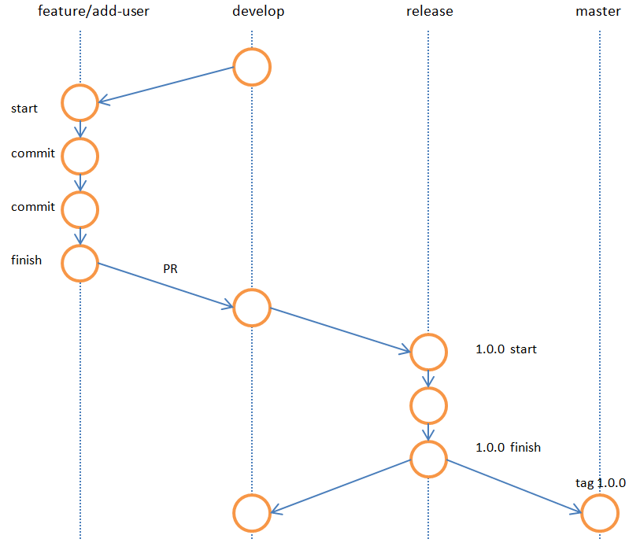
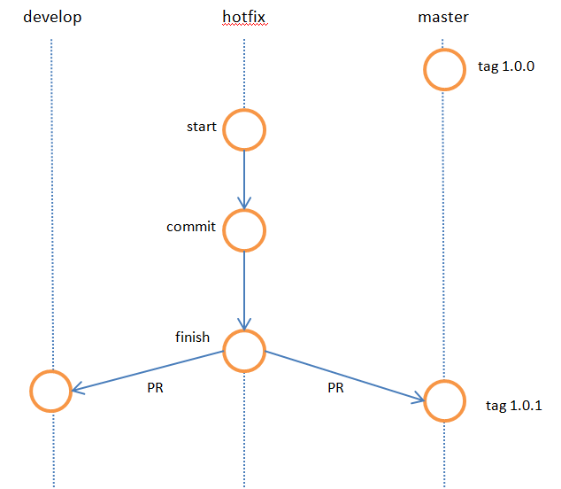

# Git-flow简介

## 目录
[TOC]

荷兰程序员 Vincent Driessen 曾发表了一篇[博客](http://nvie.com/posts/a-successful-git-branching-model/)，让一个分支策略广为人知。具体流程见下图（引用该博客的一幅图片）


这一流程最大的亮点是考虑了紧急Bug的应对措施，整个流程显得过于复杂，所以在实施该方案前，需要对整个开发流程进行系统的学习。也需要借助Git flow 等工具的辅助。

下面根据上图，按不同分支 进行 说明：

## 一、Git-flow使用步骤


### （一）master 分支

在Git Flow 中，master和develop分支至关重要，它们会贯彻整个流程始终，绝对不会被删除。master 分支时常保持着软件可以正常运行的状态。由于要维护这一状态，所以不允许开发者直接对master 分支的代码进行修改和提交。

其他分支的开发工作进展到可以发布的程度后，将会与master分支进行合并，并且这一合并只在发布成品时进行。发布时将会附加版本编号的Git标签。

### （二）develop分支

develop分支是开发过程中代码中心分支。与master 分支一样，这个分支也不允许开发者直接进行修改和提交。

程序员要以develop分支为起点新建feature 分支，在feature 分支中进行新功能的开发或者代码的修正。也就是说develop分支维系着开发过程中的最新代码，以便程序员创建feature分支进行自己的工作。

### （三）在feature 分支中工作

feature 分支以develop分支为起点，是开发者直接更改代码发送提交的分支。开发流程：

1. 从develop分支创建feature分支
2. 从feature分支中实现目标功能
3. 通过Github 向develop发送pull request
4. 接受其他开发者审核后，将Pull Request**合并至develop分支**

具体指令：
~~~shell
$ git checkout develop
$ git pull
$ git flow feature start add-user //add branch feature/add-user
$ git branch
// feature/add user  start commit commit ....
$ git push orgin feature/add-user
//到github 上去代码审查，切到develop分支，进行pull request 
$ git checkout develop
$ git pull // 当feature/add-user 合并到 develop后，本地develop 需要更新到最新状态
~~~
注意，默认状态是pull request 到master。这时需要手动切换到develop分支，再进行pull Request 操作。
如果采用该开发策略，那么可以在setting 中 Option 中，修改Default Branch 为 develop ，这样就省去了手动修改的麻烦。

与develop分支合并后，已经完成工作的feature分支可以在适当的时机删除



### （四）更新本地的develop分支

我们发送的pull request 在github 端与develop 合并后，为了让其反应到本地的develop分支中，我

们需要进行以下操作：

- 切换到develop分支
- 执行git pull (fetch & merge)

每当需要从develop分支创建feature等分支时，记得一定要先执行上述操作，保证develop分支处于最新状态。

### （五）release分支

**创建 release分支 \**，在这个分支，我们\**只处理与发布前准备相关的提交**，比如版本编号变更的元数据的添加工作。如果软件部署到预演环境后测试出bug，相关修正也要提交到这个分支。

注意：该分支绝对不能包含需求变更或者功能变更等重大修正。这一阶段的提交数应该限制到最低。

```shell
$ git checkout develop
$ git pull
$ git flow release start '1.0.0'
```

当所有修正处理完后，我们结束这分支

```shell
$ git flow release finish '1.0.0'
//期间会需要填写 提交信息、这个版本的提交信息、合并的提交信息。无特殊情况，一般默认。
```

全部结束后，会显示如下

```shell
$ git flow release finish '1.0.0'
Switched to branch 'master'
Your branch is up-to-date with 'origin/master'.
Merge made by the 'recursive' strategy.
 README.md | 2 ++
 1 file changed, 2 insertions(+)
Switched to branch 'develop'
Your branch is up-to-date with 'origin/develop'.
Already up-to-date!
Merge made by the 'recursive' strategy.
Deleted branch release/1.0.0 (was d3f54a0).

Summary of actions:
- Release branch 'release/1.0.0' has been merged into 'master'
- The release was tagged '1.0.0'
- Release tag '1.0.0' has been back-merged into 'develop'
- Release branch 'release/1.0.0' has been locally deleted
- You are now on branch 'develop'
```

### （六）查看版本tag

通过前面一系列的操作，我们创建了与发布版本号相同的Git标签

```shell
$ git tag
1.0.0
```

### （七）更新到远程仓库

对此，我们对多个分支进行了修改，所以需要利用push操作将修改更新到Github端的远程仓库。先从develop开始

```shell
$ git push origin develop
```

然后是master

```shell
$ git checkout master
$ git push origin master
```

再push 标签信息

```shell
$ git push --tags
```

这样版本号 1.0.0 的标签信息就已经push 完成

### （八）在hotfix 分支下工作

下述情况需要创建 hotfix 分支

- release 版本中发现了bug 或者漏洞
- develop 分支正在开发新功能，无法面向用户进行发布
- 漏洞需要及早处理，无法等到下一次版本发布

假设修复BUG 后的版本至 1.0.1

```shell
$ git fetch origin
```

现在以1.0.0的标签信息为起点，创建名为1.0.1 的hotfix分支。

```shell
$ git flow hotfix start '1.0.1' '1.0.0'
```

修复工作结束后，将hotfix 分支push 到github端的远程仓库，并向master分支发起Pull Request

```shell
$ git push origin hotfix/1.0.1
```



### （九）创建标签和进行发布

在Github项目主页，点击release ，为本次hotfix 创建1.0.1标签。点击 Draft a new release  按钮，输入相关标签信息，在Target中指定master分支（master分支已经合并了hotfix1.0.1的修改）。然后填写相关信息，点击Publish release 进行发布

1.0.1发布后，之前发布的成品也就完成了生命周期

```shell
$ git fetch origin
```

### （十）从 hotfix 分支合并到develop 分支

登录到Github，从hotfix1.0.1分支向develop分支发送Pull Request即可。审查后便会被合并到develop分支

建议把开发流程图放大贴在墙上，这样能够有效帮助团队成员理解流程内容

版本号的分配规则 x.y.z

x: 在重大功能变更，或者版本不向下兼容+1，此时y z归零
y: 在添加新功能或者删除已有功能+1 此时z归零
z: 只在进行内部修改后+1.

## 二、总结

Git flow是最早倡导使用git分支策略的方案之一，它引起了很多关注。它提倡应该有一个主干分支和一个独立的开发分支，并支持特性、发布和补丁分支。开发在开发分支上，之后移动到发布分支并最终合并到主干分支中。 Git flow是一个定义良好的标准，但其复杂性引入了两个问题。第一个问题是开发人员必须使用开发分支而不是主干分支，主干分支是为要发布到生产的代码保留的。将master设置为您默认分支的名称是一种惯例，绝大多数的其他分支来源于此，并最终合并于此。由于大多数工具会自动使用master分支作为默认分支，并且默认显示master分支，因此老是切换到另一个分支是很烦人的。 git flow的第二个问题是补丁和发布分支引入的复杂性。这些分支对于某些组织来说可能是一个好主意，但对绝大多数组织来说都是过度的。如今大多数组织都在实施持续交付，这意味着我们可以部署默认分支。这样就可以避免使用补丁和发布分支，包括他们引入的所有流程。这个流程的一个例子是发布分支的合并。虽然存在专门的工具来解决这个问题，但它们需要文档并且增加了复杂性。通常，开发人员会犯错误，例如变更只合并到了主干中，而没有合并到开发分支中。这些错误的根本原因是git flow对于大多数用例来说过于复杂。并且执行发布并不意味着也会执行修补程序。

## 关于

- 参考:
  - https://www.jianshu.com/p/0080df2c2d8c
  - http://www.ruanyifeng.com/blog/2012/07/git.html
- 整理: 唐力伟
- 时间：
	- 20200419: 创建