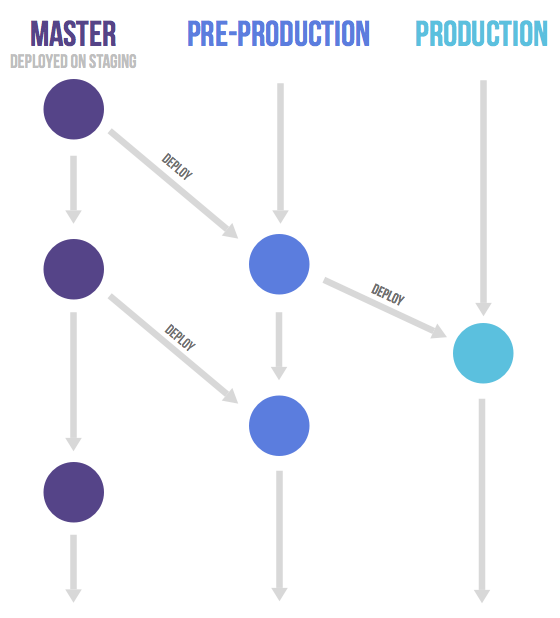
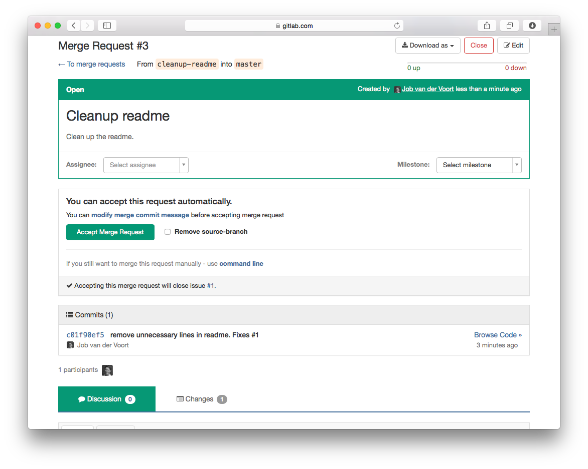

# Gitlab-flow入门

## 目录

[TOC]

## 一、主要分支

### （一）生产分支

GitHub Flow确实假设您每次合并功能分支时都可以部署到生产环境。这对于SaaS应用程序是可行的，但在许多情况下这是不可能的。一种情况是您无法控制确切的发布时刻，例如需要通过AppStore验证的iOS应用程序。另一个例子是当你有部署窗口时（工作日从上午10点到下午4点，当运营团队满负荷运转时），你也可以在其他时间合并代码。在这些情况下，您可以创建一个反映已部署代码的生产分支。您可以通过将master合并到生产分支来部署新版本。如果您需要知道生产中的代码，您可以检出生产分支以查看。在版本控制系统中，合并提交很容易看到部署的大致时间。如果您自动部署生产分支，则此时间非常准确。如果您需要更准确的时间，则可以让部署脚本在每个部署上创建标记。此流程可避免git flow中常见的释放，标记和合并开销。

### （二）环境分支

拥有一个自动更新到主干分支的环境可能是个好主意。仅在这种情况下，此环境的名称可能与分支名称不同。假设您有一个临时环境，一个预生产环境和一个生产环境。在这种情况下，主干分支部署在临时环境上。当有人想要部署到预生产时，他们会创建从主干分支到预生产分支的合并请求。而将预生产分支合并到生产分支则会触发代码的上线。这种变更提交（commits）只向下游流动的工作流可确保所有变更在所有环境中都经过测试。如果您需要cherry-pick一个包含修补程序的提交，通常做法是在功能分支上开发它并使用合并请求将其合并到master中，不要删除该功能分支。如果主干分支自动测试通过（如果你正在实行持续交付，那么它就应如此），之后你就可以把它合并到其他分支。在某些情况下，可能需要执行更多的手工测试（这导致无法执行上述的主干->预生产->生产合并的标准流程），那么您可以从特性分支发送合并请求到下游分支。环境分支的“极端”版本正在为Teatro创建每个功能分支的环境。

### （三）发布分支

只有在您需要向外界发布软件时，才需要使用发布分支。在这种情况下，每个分支包含次要版本（2-3-stable，2-4-stable等）。 stable分支使用master作为起点，并尽可能晚地创建。通过尽可能晚地创建分支，您可以最大限度地减少将bug fixes应用于多个分支所花费的时间。在一个发布分支被公布后，仅有严重错误的修复能被包括在该分支中。如果可能的话，这些bug fixes应首先合并到master中，然后cherry-pick到发布分支中。这样你就不会忘记将它们cherry-pick到master中，以避免在后续版本中遇到相同的bug。这被称为“上游优先”策略，也是谷歌和红帽实施的策略。每次在发布分支中包含错误修复时，都会通过设置新标记来增加补丁的版本号（以符合语义版本控制）。有些项目还有一个稳定的分支，指向与最新发布的分支相同的提交。在此流程中，拥有生产分支（或git flow 的master分支）并不常见。

## 二、常用功能

### （一）使用Merge/pull Request

合并或拉取请求在git管理应用程序中被创建，并要求指定一个人员合并两个分支。 GitHub和Bitbucket等工具选择将此操作称为pull request，因为（管理员）第一个手动操作是拉取特性分支。而诸如GitLab和Gitorious之类的工具选择将之称之为merge request，因为这是（提交者）请求的最终操作。 在本文中，我们将它们称为merge request（合并请求）。

如果您在功能分支上工作超过几个小时，最好与团队的其他成员分享中间结果。 这可以通过创建合并请求而不将其分配给任何人来完成，而不是在请求描述中提到某人或在评论中@某人（/ cc @mark @susan）。 这意味着它还没有准备好合并，但欢迎反馈。 您的团队成员可以针对合并请求进行普通的注释，也可以针对特定行进行行注释。合并请求用作代码审查工具，不需要单独的工具，如Gerrit和reviewboard。 如果审查中发现缺点，任何人都可以提交并推送一个修复。 通常，执行此操作的人是合并/拉取请求的创建者。 当在分支上推送新提交时，合并/拉取请求中的差异会自动更新。

如果您对合并它感到满意，可以将其分配给最了解您正在更改的代码库的人，并提及您想要反馈的任何其他人。 有更多反馈的空间，并且在指定的人对结果感到满意之后，分支被合并。 如果分配的人感觉不满意，他们可以在不合并的情况下关闭合并请求。

在GitLab中，通常保护长期存在的分支（例如主干分支），以便普通开发人员不能修改这些受保护的分支。 因此，如果要将其合并到受保护的分支中，请将其分配给具有主干授权的人员。

###  （二）Issues

GitLab flow是一种使代码和问题跟踪器之间的关系更加透明的方法。

对代码的任何重大更改都应从描述目标的问题开始。 每次对于代码的变更都保证有一个原因，这对于通知团队中的每个人并帮助人们保持功能分支在一个较小的范围非常重要。 在GitLab中，对代码库的每次更改都始于问题跟踪系统中的问题。 如果没有问题，涉及大量工作的（超过1小时），则应首先创建问题。 对于许多组织而言，这将是自然的，因为必须针对sprint（敏捷术语）设置问题。 问题标题应描述系统所预期的状态，例如： “作为管理员，我想删除用户而不会收到报错”，而不是“管理员无法删除用户”。

当您准备好编码时，您可以基于主干分支创建该问题的分支。 此分支的名称应以问题编号开头，例如'15 -require-a-password-to-change-it'。

当您完成或想要讨论代码时，您可以开启一个合并请求。 这是一个讨论变更并查看代码的在线地址。 创建分支是一种手动操作，因为您并不总是希望合并您推送的新分支，它可能是一个长期运行的环境或发布分支。 如果您创建合并请求但未将其分配给任何人，则它是“在制品”合并请求。 这些用于讨论请求中所提议的实现，但尚未准备好包含在主分支中。

当作者认为代码已准备好时，合并请求将分配给审阅者。 审阅者在认为代码已准备好包含在主分支中时按下合并按钮。 在这种情况下，代码将被合并，并生成合并提交，以便稍后可以轻松地看到此事件。合并请求总是创建一个合并提交，即使没有合并提交也可以事后添加。这种合并策略在git中称为“no fast-forward”。 合并后，功能分支将被删除，因为不再需要它，在GitLab中，此删除是合并时的一个选项。

假设分支已合并但出现了一个问题，issue被重新打开（reopen）。 在这种情况下，重用相同的分支名称没有问题，因为它在合并分支时被删除了。 每个问题最多只有一个分支。 一个功能分支可能解决了多个问题。

### （三）从和并请求中链接和关闭问题

通过从提交消息（fixes #14, closes #67, etc.）或合并请求描述中提及它们，可以实现链接到该问题。 在GitLab中，这会在合并请求提及的问题中创建一条注释。 合并请求显示链接的问题。 一旦代码合并到默认分支，这些问题将被关闭。

如果您只想在不关闭问题的情况下进行参考，您也可以提一下：“Ducktyping is preferred. #12”。

如果您遇到跨多个存储库（repositories）的问题，最好的办法是为每个存储库创建一个问题，并将所有问题链接到父问题。

### （四）使用rebase压缩commits

使用git，您可以使用交互式的rebase指令（rebase -i）将多个提交压缩为一个并重新排序。 如果您在开发期间针对少量更改进行了多次提交，并希望用单个提交替换它们，或者如果您希望使提交顺序更符合逻辑，则此功能非常有用。 但是，您永远不应该rebase那些已推送到远程服务器的提交。 有人可能已经引用了这些提交或已经cherry-pick了它们。 当您rebase时，您更改了提交的标识符（SHA1），这很令人困惑。 如果您这样做，在多个标识符下会知道相同的更改，这可能会导致很多混淆。 如果人们已经审查过您的代码，那么如果您将所有内容rebase为一次提交，那么他们将很难仅查看您之后所做的改进。

人们被鼓励经常提交并经常推送到远程存储库，以便其他人知道每个人都在做什么。 这将导致每次更改产生许多提交，这使得历史记录更难理解。 但是，具有稳定标识符的优点超过了这个缺点。 要理解上下文中的更改，可以始终查看合并提交，该合并提交将代码合并到主分支时将所有提交组合在一起。

将多个提交从功能分支合并到主分支后，这很难撤消。 如果您将所有提交压缩为一个，那么您可能只是恢复了此提交，但正如我们所指出的那样，您不应该在推送远程仓库后rebase提交。 幸运的是，使用git可以撤销一段时间之前做出的合并。 但是，这需要为要撤销的提交进行特定的合并提交。 如果你撤销合并之后又改变主意，请撤销之前的撤销合并而不是再次合并，因为git不会允许你再次合并代码。

当您使用--no-ff选项手动合并时，能够撤销此合并（对于为什么要每次创建合并提交而言）是一个很好的理由。 当您接受合并请求时，Git管理软件将始终创建合并提交。

### （五）不要使用rebase对提交进行排序

使用git，您还可以rebase功能分支的提交，以便在主干分支上提交后对它们进行排序。 这可以避免在将master合并到您的功能分支时创建合并提交，并创建一个漂亮的线性历史记录。 然而，就像压缩操作一样，您永远不应该rebase那些已经提交至远程服务器的commits。 这使得您无法rebase那些我们推荐的，您已经和您的团队分享的工作进程。 使用rebase更新功能分支时，需要反复解决类似的冲突。 有时您可以重用记录的解决方案（重放），但如果不做rebasing，您只需解决一次冲突，就可以设置。必须有更好的方法来避免许多合并提交。

避免创建许多合并提交的方法是不经常将master合并到功能分支中。我们将讨论在master中合并的三个原因：利用代码，解决合并冲突和长期运行的分支。如果您需要在创建功能分支后利用master中引入的一些代码，您有时可以通过cherry-pick来解决这个问题。如果您的功能分支存在合并冲突，则创建合并提交是解决此问题的常用方法。您的目标应该是避免可能发生的合并冲突。一个示例是CHANGELOG文件，其中代码库中的每个重要更改都记录在版本标头下。而不是每个人都在列表底部为当前版本添加更改，最好将其随机插入该版本的当前列表中。这可能是在发生冲突之前可以合并添加到CHANGELOG的多个功能分支。创建合并提交的最后一个原因是拥有长期存在的分支，您希望与项目的最新状态保持同步。 Martin Fowler在他关于功能分支的文章中讨论了这种持续集成方案（CI）。在GitLab，我们犯了将CI与分支测试混淆的错误。引用Martin Fowler的话：“我听说有人说他们正在做CI，因为他们正在运行构建，可能使用CI服务器，每次提交都会在每个分支上运行。这是持续构建，并且是一件好事，但是没有集成，所以它不是CI。“防止许多合并提交的解决方案是使您的功能分支生命周期尽可能短，绝大多数应该花费不到一天的工作。如果您的特性分支通常需要一天以上的工作，请研究创建较小工作单元和/或使用特性切换的方法。对于那些需要超过一天的长期分支而言，有两种策略。在CI策略中，您可以在一天开始时在master中合并，以避免以后出现痛苦的合并。在同步点策略中，您只能从明确定义的时间点合并，例如标记的版本。 Linus Torvalds提倡这种策略，因为这些点的代码状态更为人所知。

总之，我们可以说你应该尝试避免合并提交，但不能完全消除它们。 您的代码库应该是干净的，但您的历史记录应该代表实际发生的事情。 开发软件的过程非常简单，您的历史记录可以反映这一点。 您可以使用工具查看提交的网状图，并试图了解创建代码的混乱的历史记录。 如果您对代码进行rebase，则历史记录就会不正确，并且工具无法解决此问题，因为它们无法处理更改的提交标识符。

### （六）对合并请求投票

通过使用+1或-1表情符号来表达批准或拒绝是很常见的。 在GitLab中，+1和-1被聚合并显示在合并请求的顶部。 根据经验，任何+1没有超过-1两倍以上的合并请求都是可疑的，不应该被合并。

### （七）推送和删除分支

我们建议人们经常推送他们的功能分支，即使他们还没有准备好进行审查。这样做可以防止团队成员意外地开始处理同一个问题。当然，这种情况应该已经通过在问题跟踪软件中为问题指派某人来防止了。然而，有时双方中的一方可能会忘记在问题跟踪软件中指派某人。分支合并后，应将其从源代码管理软件中删除。在Gitlab和类似系统中，这是合并时的一个选项。这样可以确保存储库管理软件中的分支概述只显示正在进行的工作。这还确保了当有人重新打开问题时，可以毫无问题地使用具有相同名称的新分支。重新打开问题时，需要创建新的合并请求。

### （八）经常commit并填写正确的message

我们建议尽早和经常提交。每次你有了一组含有测试和代码的功能集时，都可以提交。其优点是，当扩展或重构出错时，能够很容易恢复到正在工作的版本。对于以前使用SVN的程序员来说，这是一个很大的变化，当他们的工作准备好共享时，他们常常提交。技巧是当您的工作准备好共享时，将合并/拉取请求与多个提交一起使用。提交消息commit message应该反映您的意图，而不是提交的内容。无论如何，提交的内容都很容易看到，问题是为什么要这样做。一个good commit message的例子是：“合并模板并清空用户视图”。因为不包含意图信息而导致其成为bad commit message的一些词是：更改、改进和重构。单词fix或fixes也是一个禁词，除非它出现在commit语句之后并且引用了一个问题编号。要查看有关提交消息格式的更多信息，请参阅TimPope撰写的这篇伟大的博客文章。

### （九）合并前测试

在旧的工作流中，持续集成（CI）服务器通常只在主干分支上运行测试。开发人员必须确保他们的代码不会破坏主干分支。当使用Gitlab flow时，开发人员从这个主干分支创建他们的分支，所以它是绿色的。因此，在接受每个合并请求之前，必须对其进行测试。像Travis和Gitlab CI这样的CI软件在合并请求自身中显示了构建结果，以使之变得容易。一个缺点是他们正在测试特性分支本身，而不是合并的结果。要改善这一点，我们可以做的是测试合并结果本身。问题是每次将某些内容合并到主干分支时，合并结果都会发生更改。对每一个给master的提交进行重新测试的性能代价很高，这意味着您更频繁地等待测试结果。如果没有合并冲突，并且功能分支生命期较短，那么风险是可以接受的。如果存在合并冲突，则将主分支合并到功能分支中，CI服务器将重新运行测试。如果您有长期使用的功能分支，并且这些分支持续几天以上，那么您应该将问题（issue）拆分得更小。

### （十）合并其他代码

当启动一个功能分支时，总是从一个最新的主干分支开始。如果你事先知道你的工作完全依赖于另一个分支，你也可以从那里开始创建新分支。如果在开始之后需要在另一个分支中合并，请在合并提交中解释原因。如果您还没有将提交推送到共享仓库，那么您还可以在master或另一个功能分支上重新设置。如果你的代码可以很好地工作和合并，那么不要向上游合并，Linus甚至说你永远不应该在上游的随机点合并，只在主要版本中合并。只有在需要时才进行合并，这能避免在特性分支中创建那些最终会导致主干的历史记录混乱的合并提交。

## 关于

- 参考: https://www.jianshu.com/p/0080df2c2d8c
- 整理: 唐力伟
- 时间: 
	- 20200419: 创建 